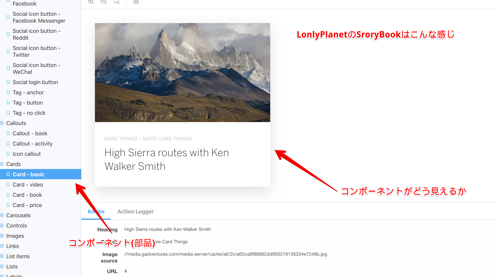
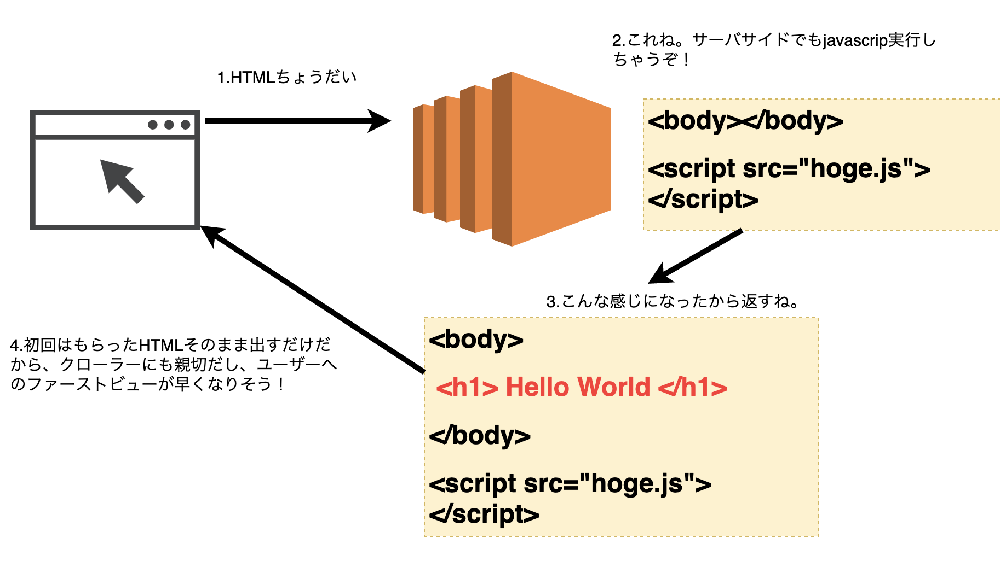
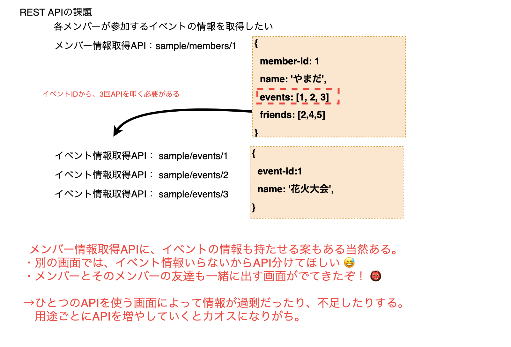

import Icons from "../src/components/Icons.js"

###  デザインを部品ごとにばらして、そのカタログを表示するサイトも作ろう。

<Icons
  srcs={[
    "storybook.png",
  ]}
/>




<hr/>

### SEOやパフォーマンスを意識して、サーバサイドで事前にjavascriptを実行して、レンダリング済みのhtmlを返せるようにしよう。

<Icons
  srcs={[
    "next.png",
    "nuxt.png",
  ]}
/>



<hr/>

### 保守性をあげるためにjavascriptにも型システムをもたせよう。

<Icons
  srcs={[
    "ts.png",
  ]}
/>

javascriptの世界

```javascript
// 誕生年を渡して、年齢を計算する関数っぽいけど、引数のbirthYearは、文字列なのか数値なのかどっちなんだろう、、、
// 返ってくる値もどっちなんだろう、、、
function calcAge(birthYear) {
  // 内部処理は数値がくることを前提に作成されている
  // 省略
}

// ええい、ままよ！
const age = calcAge("2000")
```

TypeScriptの世界

```javascript
// 引数も返り値も数値なんだね！
function calcAge(birthYeaer:number):number {
  // 省略
}

// 数値以外の値を渡したら、ちゃんとコンパイルエラーになるんだ！
const age = calcAge("2000")
```

<hr/>

### もちろんテストコード書くよね。

<Icons
  srcs={[
    "jest.png",
  ]}
/>

```javascript
 it('メッセージに「餃子に」が含まれていて、数値がある場合、数値の内容をfirebaseに保存して、メッセージ「🥟から1,000円を入れるね」を返すこと', async () => {
    const app = await setup()
    const message = '餃子に1000'
    const res: any = await request(app)
      .post('/bot/webhook')
      .send({ message })
    expect(res.body).toEqual([
      {
        message: {
          text: '🥟に1,000円を入れるね',
          type: 'text',
        },
      },
    ])
  })
```

<hr/>

### サーバに要求するデータもフロントから柔軟に要求できるようにしよう。

<Icons
  srcs={[
    "graphql.png",
  ]}
/>



<hr/>

### なんならサーバも、Firebaseや、CloudFunction、AWS Lamda + Node.jsを使って、フロントの人間が書いちゃおう。

<Icons
  srcs={[
    "firebase.png",
    "lamda.png",
    "cloudfunctions.png",
  ]}
/>

### あれだったら、事前に必要なAPI叩いて、静的サイトにしてセキュリティもパフォーマンスも向上させちゃえ。

<Icons
  srcs={[
    "gatsby.png",
  ]}
/>

### javascriptでNativeAppも作れるようにしよう。

<Icons
  srcs={[
    "reactnative.png",
  ]}
/>

### いや、Webのままネイティブでしかできなかったことをできようにしよう。

<Icons
  srcs={[
    "pwa.png",
  ]}
/>

<br/>
<br/>

### 今フロントエンドに求められるスキル

- SEO、アクセシビリティを意識したHTMLを書けること。
- デザイナが作成したデザインをブラウザごとに再現させるCSSを書けること。

<div style={{  color: 'tomato' }}>
    <h2>・プロダクトに応じた最適な技術選定、構築ができること。</h2>
    <h2>→巨人の肩にうまくのれるかどうかで生産性・保守性・拡張性が段違い！</h2>
</div>